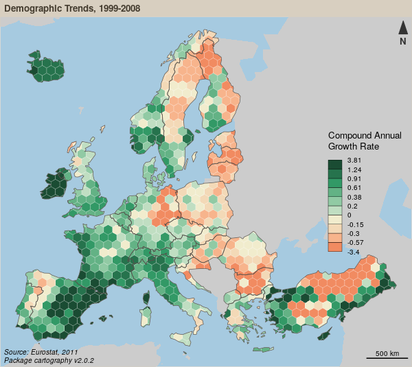

# Faire des cartes avec R : le package `cartography`
*Webinar [Tuto@Mate](http://mate-shs.cnrs.fr/?les-tutos-mate) du 3 avril 2018*

R est un langage et un environnement open source et multiplateforme permettant de réaliser une variété de traitements statistiques et de représentations graphiques.  
Son utilisation en géographie et en cartographie permet de simplifier les chaînes de traitements et d’inscrire pleinement les analyses dans une démarche de recherche reproductible.  
Lors de cette séance nous aborderons les fonctionnalités spatiales du logiciel et plus particulièrement le package de cartographie thématique [`cartography`](https://github.com/riatelab/cartography).    

 

  
 
[Slides de la présentation](https://rcarto.github.io/tuto-mate/index.html)

